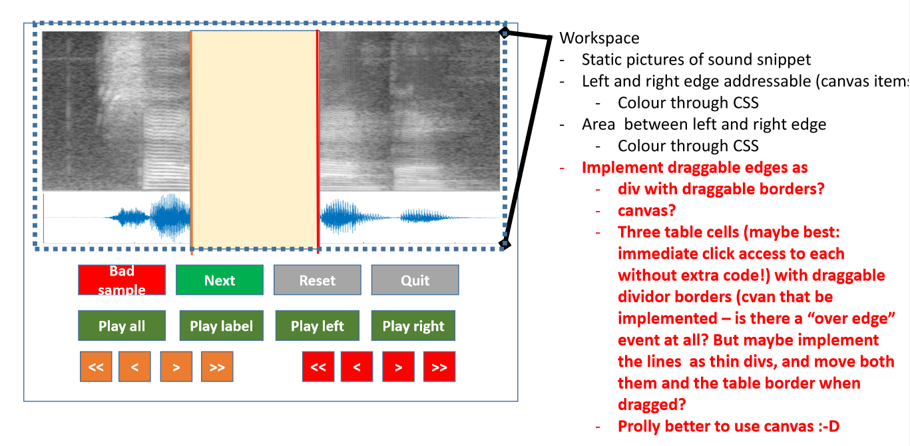

# SegmentChecker

Tool for revising segment boundaries.

## Source data

Audio URL with segment type and time chunks (in milliseconds). Example:

    
     $ cat data/source/tillstud_demo_2_Nx_Tal_1_2020-08-24_141655_b35aa260_00001.json 
     {
      "uuid": "7c836914-2d9d-11eb-91e4-2c4d54557184",
      "url": "http:/localhost:7371/audio/rispik/tillstud_demo_2_Niclas_Tal_1_2020-08-24_141655_b35aa260.wav",
      "segment_type": "silence",
      "chunk": {
       "start": 26973,
       "end": 28067
      }
     }
     
     $ cat data/source/tillstud_demo_2_Nx_Tal_1_2020-08-24_141655_b35aa260_00002.json 
     {
      "uuid": "7c836a21-2d9d-11eb-91e4-2c4d54557184",
      "url": "http:/localhost:7371/audio/rispik/tillstud_demo_2_Niclas_Tal_1_2020-08-24_141655_b35aa260.wav",
      "segment_type": "silence",
      "chunk": {
       "start": 32550,
       "end": 36004
      }
     }

Segment types: silence, "e" (the vowel), etc.

Only one segment type is revised at a time. For _silence_ segments: if a file contains three pauses, it will be revised in three steps. Other segment types are not checked.

## Annotation data

    $ cat 7c8366a8-2d9d-11eb-91e4-2c4d54557184.json 
    {
      "uuid": "7c8366a8-2d9d-11eb-91e4-2c4d54557184", // points to the uuid in the corresponding source file
      "url": "http:/localhost:7371/audio/rispik/tillstud_demo_2_Nx_Tal_1_2020-08-24_141655_b35aa260.wav",
      "segment_type": "silence",
      "chunk": {
       "start": 1500,
       "end": 3822
      },
      "labels": [],
      "status": {
       "name": "ok",
       "source": "hanna",
       "timestamp": "Mon, 23 Nov 2020 19:24:11 GMT"
      },
      "comment": ""
     }

## Layout draft

## Tool functionality

* manually adjust segment boundaries, one chunk at a time
* play buttons for left context/right context/segment only/all
* mark with status "SKIP" or "OK"
* optional label "Bad sample"
* one free text comment is allowed
* include username + timestamp in status?
* navigate to next, prev, first, last
* navigation goes to next disregarding status, or next unchecked? prev unchecked or just previously checked? or both?
* audio sample to display is max 5 seconds total (usually less)
* default values for left/right context length:
  - 200ms for vowel segments
  - 1s for silence 
* left/right context length should be configurable
* no zoom possibility for now

## Licenses
The tool should be licensed under Apache 2.0.

The wavesurfer-js library is licensed under [BSD-3](https://opensource.org/licenses/BSD-3-Clause), which means it can be used with Apache 2.0.

## Tasks
Create a demo as soon as possible

1. Design protocol for source data
2. Send protocol for source data to Jens
3. Create layout based on provided draft above
4. Create simplified GUI (to run without server)
5. Create protocol for annotation data
6. File/folder hierarchy
7. Create server with Rest API

## Deadlines 
* If we could have a demo ready on Nov 27th that would be great, but it's not expected
* Have something usable ready before Christmas (preferably 1-2 weeks before)

## Future
"fuzzy" greppyta för segmentgränserna (Jens: _jag insåg just att det inte finns någon speciell poäng med att man ska behöva slita med att få tag på just strecken/kanten... det går att ha mycket större aktiva ytor, tex vänster/höger hälft av mittensegmentet eller det vänstra/högra segmentet eller en kombination. eller två separata drag targets, kanske till och med ännu bättre._)

---

# Runnable example server

1. Retrieve the file `audio.zip` provided by Hanna
2. Retrieve the file `data.zip` provided by Hanna
3. `git clone git@github.com:stts-se/segment_checker`
4. `cd segment_checker`
5. `unzip audio.zip`
6. `unzip data.zip`
7. `go run cmd/serv/main.go -serve cmd/serv/static/ -source data/source/  -annotation data/annotation`
8. Visit `http://localhost:7371` using your browser (Firefox is recommended)
