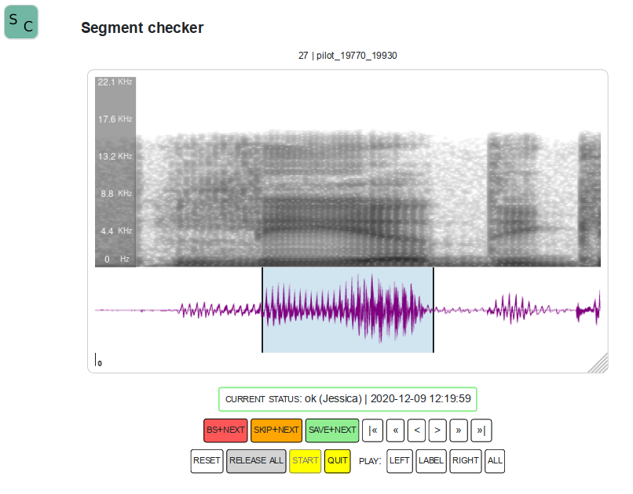

# SegmentChecker

 

Tool for revising segment boundaries. Developed by [STTS](https://stts.se) on behalf of [TMH](https://www.speech.kth.se).

## Functionality

* manually adjust segment boundaries, one chunk at a time
* play buttons for left context/right context/segment only/all
* save with status "SKIP" or "OK", and optional label "Bad sample"
* one free text comment can be added per segment
* navigation to next, prev, first, last given the specified request status (for now: unchecked, checked, ok, any)
* audio sample to display is expected to be max 5 seconds total (usually less)
* default values for left/right context (hardwired on server)
  - e: 200ms
  - silence: 1000ms
  - other segments: 1000ms
* for advanced users, left/right context length can be configured
* no zoom possibility for now

## Licenses

This tool is licensed under Apache 2.0.

The wavesurfer-js library is licensed under [BSD-3](https://opensource.org/licenses/BSD-3-Clause) (compatible with Apache 2.0).

## Requirements
* [golang 1.15](https://golang.org/dl/)
* [ffmpeg](https://ffmpeg.org/)

## Preparation
1. Clone the repository: `git clone https://github.com:stts-se/segment_checker`
2. Change directory: `cd segment_checker`

<!--
# Install pre-compiled binaries

Requirements:
* [ffmpeg](https://ffmpeg.org/)

Use one of the available [releases](https://github.com/stts-se/segment_checker/releases). See the release's README file for further instructions.
-->

# Demo application

This repository includes audio based on the Swedish Wikipedia page about easy to read texts: [https://sv.wikipedia.org/wiki/Lättläst](https://sv.wikipedia.org/wiki/L%C3%A4ttl%C3%A4st)

Part of the page has been recorded, and pauses have been labelled automatically.

You can use the demo data to review the pauses.

## 1. Unpack demo data

`unzip demo_project_lattlast.zip`

## 2. Start the application server

This command will start the server on `localhost`:

`go run cmd/app_server/main.go -serve cmd/app_server/static -project projects/demo_lattlast`

For external access, use the `host` flag to set an explicit hostname/IP.

## 3. Use the application

Visit `http://localhost:7371` using your browser (Firefox is recommended)

# Using the application with other data

## 1. Define the project

Create a `project folder` named after the project, for example `projects/<projectname>`.

## 2. Prepare data

The source data consists of one JSON file per labelled segment, with the following required attributes:

* `id`: should be unique within the project
* `url`: audio URL (see section _Serve audio_ below)
* `segment_type`: "silence" or "e" (the vowel)
* `chunk`: start and end time (milliseconds) for the labelled segment

Example:
    
     $ cat projects/demo_lattlast/source/lattlast_ogg_0001.json
     {
       "id": "lattlast_ogg_0001",
       "url": "http://localhost:7371/audio/lattlast.ogg",
       "segment_type": "silence",
       "chunk": {
        "start": 3935,
        "end": 5051
       }
    }

Source data should be placed in a folder titled `source` inside the project folder. In this example, we will use `<project folder>/source`.

## 3. Serve audio

If you want the application to serve the audio, place your audio files in `<project folder>/audio`. You can also have a separate server serving the audio if you prefer that.

## 4. Start the application server

`go run cmd/app_server/main-go -serve cmd/app_server/static -project <project folder>`

For external access, use the `host` flag to set an explicit hostname/IP.

## 5. Use the application

Visit `http://localhost:7371` using your browser (Firefox is recommended)

## Annotated data

Annotated data will be placed in a folder named `annotation`, inside the project folder. In this example, it will be `<project folder>/annotation/`. Each segment will be saved in a file named `<id>.json`

Example:

    $ cat projects/demo_lattlast/annotation/lattlast_ogg_0001.json
    {
      "id": "lattlast_ogg_0001",
      "url": "http://localhost:7371/audio/lattlast.ogg",
      "segment_type": "silence",
      "chunk": {
       "start": 4001,
       "end": 5051
      },
      "current_status": {
       "name": "ok",
       "source": "hanna",
       "timestamp": "2020-12-08 19:21:43"
      }
    }

